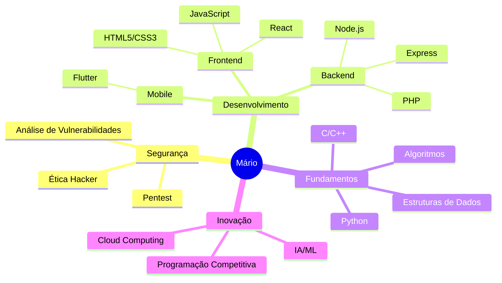

# 👨‍💻 Mário Niangi | Engenheiro de Software em Formação

<div align="center">
  
[));)](https://git.io/typing-svg)

</div>

## 🎯 Missão Pessoal
```javascript
const marioNiangi = {
  missão: "Transformar ideias em código e problemas em soluções",
  paixão: ["Segurança da Informação", "IA", "Desenvolvimento Full-Stack"],
  filosofia: "Código limpo não é apenas uma prática, é uma forma de arte"
};
```

## 🚀 Jornada Tech


## 💻 Arsenal Tecnológico

<div align="center">

| Categoria | Tecnologias |
|-----------|-------------|
| 🎨 Frontend |    |
| 💽 Backend |    |
| 📱 Mobile |  |
| 🔒 Segurança |   |
| 🗃️ Dados |  |

</div>

## 📊 Métricas de Desenvolvimento

<div align="center">
  
[](https://git.io/streak-stats)

```text
🌅 Período Mais Produtivo
                                                   
      🌗                                           
    🌕                                             
  🌓                                               
🌑                                                 
00:00 - 06:00  06:00 - 12:00  12:00 - 18:00  18:00 - 24:00
```

</div>


## 🌱 Evolução Contínua

```python
def vida_dev():
    while True:
        if encontrou_problema():
            aprender()
            tentar_novamente()
        elif alcancou_objetivo():
            celebrar()
            definir_novo_objetivo()
        else:
            continuar_codando()
```

## 📫 Conexões

<div align="center">
  
[](https://www.linkedin.com/in/marioniangi/)
[](https://twitter.com/MarioNiangi)
[](mailto:marioniangi07@gmail.com)

</div>

---
