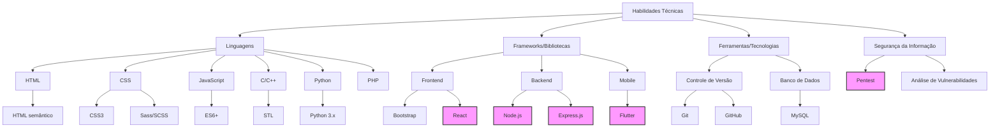

# Olá, mundo! 👋 Sou Mário Niangi

## 🚀 Sobre Mim
Estudante de Engenharia Informática, com um forte interesse em segurança da informação, programação competitiva , desenvolvimento de software e inteligência artificial.

## 🛠 Habilidades Técnicas

Legenda:
- Caixas em rosa (🌸): Tecnologias que estou atualmente aprendendo/aprimorando
- Demais caixas: Habilidades já adquiridas

## 🌱 Atualmente Aprendendo

- 🚀 Desenvolvimento Frontend com React
- 🖥️ Backend com Node.js
- 📱 Desenvolvimento Mobile e UX/UI Design com Flutter
- 🔒 Técnicas avançadas de Pentest

## 💡 Interesses
- 🛡️ Cibersegurança e Ética Hacker
- 🏆 Programação Competitiva
- 🤖 Inteligência Artificial
- 💻 Desenvolvimento de Software

## 📊 Estatísticas GitHub

## 🏆 Troféus GitHub

## 📫 Como me encontrar
- LinkedIn: https://www.linkedin.com/in/marioniangi/
- Email: marioniangi07@gmail.com
- Twitter: @MarioNiangi

---

  

